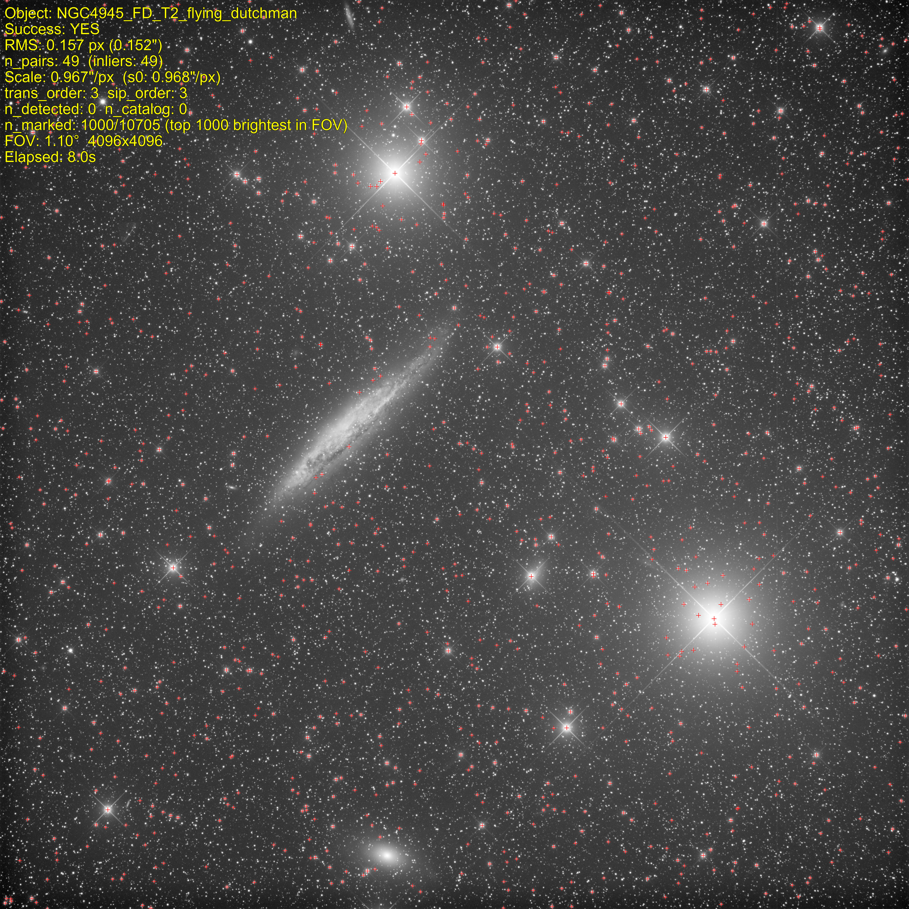
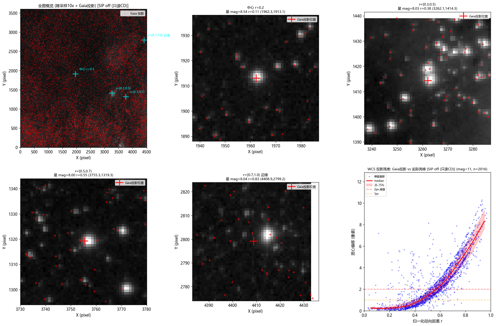
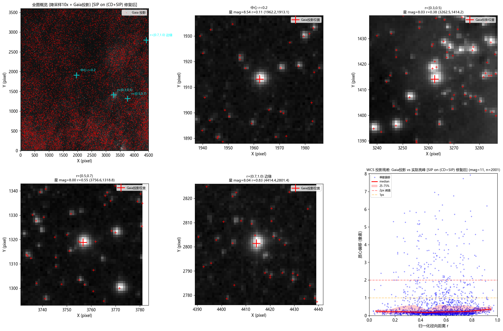

# Plate Solve - 天文图像 WCS 求解库

版本：V4.30 | 2026-07-12

> 基于 IPV (Iterative Polygon Voting) 三角法 | 当前版本 V4.30 | 成功率 99.87% | RMS 中位 0.110px | 比 Siril 快 16%

## GitHub仓库
- 仓库地址：https://github.com/fujiaze/PlateSolve-IPV-Cpp
- 默认分支：main
- 最新commit：9dafd79c

## 概述

从 FITS 图像和初始指向（RA/Dec）出发，自动检测星点、查询 Gaia DR3 星表、匹配星对、求解变换，最终输出符合 FITS/WCS 国际标准的 WCS（CD 矩阵 + CRVAL + CRPIX + SIP 畸变系数），可被 astropy/DS9/Aladin/PixInsight/Siril 等通用软件直接读取。

### 功能

- **全自动求解**：输入 FITS + 初始指向 -> 输出标准 WCS
- **多光学系统支持**：窄视场（6800mm/0.31°）到超宽视场（200mm/7.7°）全覆盖
- **高阶畸变校正**：SIP order=3 多项式 + 鲁棒扩增精化（IRLS + 网格采样）
- **三角匹配算法**：基于三角匹配原始论文（Liebe 1992, Groth 1986, Cole & Crassidis 2006, Kolomenkin et al. 2008），吸纳 Siril 剪枝方法与星点匹配综述中的优化策略
- **k-vector + PROSAC**：k-vector 快速角距检索（Mortari 1997）+ PROSAC 优先采样验证（Chum & Matas 2005）
- **OpenMP 并行**：16 线程并行求解，Gaia 缓存预热消除冷启动延迟
- **鲁棒防护**：5 层 NN 匹配防护 + CD 指数阻尼 + 失败回退，不破坏已有成功率

### 性能指标（V4.30, 790 帧全量测试）

| 指标 | IPv V4.30 | Siril CLI 1.4.4 |
|------|-----------|-----------------|
| 总成功率 | **99.87%** (789/790) | 97.59% (771/790) |
| RMS 中位 | **0.110 px** | - |
| RMS max | **0.412 px** | - |
| 耗时中位 | **1.199s** | 1.495s |
| 异常/崩溃 | **0** | - |

**各光学系统 RMS 分布**：

| 焦距(mm) | 像元(um) | 帧数 | RMS中位(px) | P90(px) | max(px) |
|---|---|---|---|---|---|
| 200 | 6.0 | 384 | 0.069 | 0.117 | 0.412 |
| 1917-1935 | 9.0 | 367 | 0.107-0.214 | 0.189 | 0.32 |
| 6800 | 9.0 | 38 | 0.315 | 0.365 | 0.41 |

## 效果展示



*红色十字 = Gaia 星表星点重投影到图像坐标系，与实际星点完美对齐（RMS 0.157px）*

### SIP 畸变修正效果（before / after）

求解器输出含前向 SIP（A/B, pix→world）和逆向 SIP（AP/BP, world→pix）系数。下图对比了仅用 CD 矩阵（SIP off）与完整 CD+SIP（SIP on）时，Gaia 星投影位置与图像实际亮峰的对齐精度：

| SIP off（仅 CD 矩阵） | SIP on（CD + SIP order=3） |
|:---:|:---:|
|  |  |

**偏移统计（Gaia 投影 vs 实际亮峰质心）**：

| 径向距离 r | SIP off median | SIP on median | 改善 |
|---|---|---|---|
| [0.0, 0.2) | 0.22 px | 0.22 px | —（中心无需修正）|
| [0.4, 0.6) | 1.44 px | 0.18 px | **-87%** |
| [0.6, 0.8) | 3.48 px | 0.22 px | **-94%** |
| [0.8, 1.0) | 6.48 px | 0.32 px | **-95%** |
| >2px 占比（r≥0.6）| 93.7%-100% | 6.3%-6.5% | **彻底解决** |

SIP on 后误差带从单调上升曲线变为水平直线（~0.2-0.3 px），边缘精度与中心一致。

### ⚠ astropy WCS API 使用注意事项

astropy 的 WCS 对象有两套坐标转换方法，**必须区分**：

| 方法 | 说明 | 是否应用 SIP |
|------|------|:---:|
| `wcs.all_world2pix()` / `wcs.all_pix2world()` | 高层方法，应用 SIP 多项式 | ✅ **是** |
| `wcs.wcs_world2pix()` / `wcs.wcs_pix2world()` | 低层方法，直接调用 wcslib C 库 | ❌ **否** |

**正确用法**（应用 SIP 修正）：

```python
from astropy.wcs import WCS

wcs = WCS(fits_header)  # 从 FITS 头构造（自动解析 A/B/AP/BP）

# world → pix（Gaia 星投影到图像）— 必须用 all_world2pix
px, py = wcs.all_world2pix(ra_deg, dec_deg, 0)

# pix → world（图像像素转天球坐标）— 必须用 all_pix2world
ra, dec = wcs.all_pix2world(px, py, 0)
```

**错误用法**（SIP 系数不生效，边缘偏移可达 10 px）：

```python
# ❌ 错误：wcs_world2pix 不应用 SIP，边缘偏移随径向距离单调增加
px, py = wcs.wcs_world2pix(ra_deg, dec_deg, 0)
```

> **根因说明**：astropy 的 `wcs_*` 前缀方法直接调用 wcslib C 库，不处理 SIP；`all_*` 前缀方法才在 Python 层应用 SIP 多项式修正。详见 [astropy WCS 文档](https://docs.astropy.org/en/stable/wcs/)。

## 使用方法

### 编译

```powershell
cd lib/plate_solve/cpp/ipv
.\build.ps1
```

**编译环境**：g++ 16.1.0 (MSYS2 MinGW64), C++17, `-O3 -ffast-math -funroll-loops -fopenmp`

**依赖 DLL**：`astro_image_io.dll`, `star_detector.dll`, `gaia_client.dll`

### Python 调用

```python
from ipv_solver import IPVSolver

solver = IPVSolver(
    dll_path="lib/plate_solve/cpp/ipv/ipv_solver.dll",
    gaia_db_path="GaiaDR3SP",
    star_detector_dll="lib/star_detector/star_detector.dll",
    image_io_dll="lib/astro_image_io/astro_image_io.dll"
)

result = solver.solve(
    image_path="image.fits",
    ra=270.70,           # 初始指向 RA (度)
    dec=-22.85,          # 初始指向 Dec (度)
    focal_length_mm=200, # 焦距
    pixel_size_um=2.4    # 像素尺寸
)

print(f"Success: {result['success']}")
print(f"RMS: {result['rms_arcsec']}\"")
print(f"CD: {result['cd_matrix']}")
```

### 批量测试

```powershell
cd lib/plate_solve/python/siril_compare
python run_ipv_baseline.py --limit 790   # IPv 790 帧基线
python run_siril_baseline.py --limit 790  # Siril 790 帧基线
```

## 架构

### 求解流水线

```
FITS 图像 ──► [1 StarSelector] ──► U (图像侧星点, 60最亮)
                                  W (星表侧星点, Gaia DR3)
                                        │
                                        ▼
                            [2 三角形匹配] (投票 + top_pairs)
                                        │
                                        ▼
                            [3 iter_trans_solve] (order=3, sigma-clip)
                                        │
                                        ▼
                            [4 iterative_reproject] (高阶重匹配)
                                        │
                                        ▼
                            [5 hi_order_rematch] (SIP 精化)
                                        │
                                        ▼
                            [6 robust_refine] (网格采样 + IRLS)
                                        │
                                        ▼
                            [7 WCS 提取] (CD/CRVAL/CRPIX/SIP order=3)
```

| 阶段 | 功能 | 耗时(典型) |
|------|------|-----------|
| 1 StarSelector | 星点检测 + Gaia 查询 + Gnomonic 投影 | 1-14s |
| 2 三角形匹配 | 60×60 投票矩阵 + top_pairs 候选 | 36ms |
| 3 iter_trans_solve | order=3 变换拟合 + sigma-clip | 5-50ms |
| 4 iterative_reproject | 高阶 TRANS 重匹配 + atRecalcTrans | <10ms |
| 5 hi_order_rematch | SIP order=3 精化 | <5ms |
| 6 robust_refine | 网格采样 + IRLS + CD 阻尼 | ~47ms |
| 7 WCS 提取 | CD/SIP 系数 + Y-down 翻译 | <1ms |

### 鲁棒扩增精化（V4.30 新增）

解决边缘精度差问题（中心 0.2px vs 边缘 0.4-0.6px）：

1. **网格配额采样**：按图像宽高比划分自适应矩形网格，每格取前 K 颗亮星，空间均匀
2. **5 层防护 NN 匹配**：容差收紧 -> Lowe ratio -> 空间一致性 -> 发散检测 -> 最终验收
3. **IRLS 鲁棒拟合**：Tukey biweight 权函数，CD 指数阻尼（<1% 自由, >3% 冻结）
4. **失败回退**：任一防护层触发 -> 返回 WCS0 原值

### 目录结构

```
lib/plate_solve/
├── cpp/ipv/                   # C++ IPV 求解器
│   ├── include/               # 头文件
│   ├── src/                   # 源文件
│   ├── build.ps1              # 编译脚本
│   └── ipv_solver.dll         # 编译产物
├── python/                    # Python 绑定
│   ├── ipv_solver.py          # ctypes 绑定 (IPVSolver 类)
│   └── siril_compare/         # Siril 对比基线脚本
├── docs/                      # 文档与预览图
├── archive/                   # 历史归档
│   ├── HISTORY.md             # 版本迭代历史
│   └── ARCHIVE_INDEX.md       # 归档索引
└── memory.md                  # 模块开发记忆
```

### 关键参数

| 参数 | 默认值 | 说明 |
|------|--------|------|
| img_n_target | 60 | 图像侧目标星数 |
| gaia_density_ratio | 1.2 | Gaia/图像密度比 |
| SIP order | 3 | SIP 畸变多项式阶数 |
| iter_trans order | 3 | 变换多项式阶数（含 fallback） |
| robust_refine grid_short | 5 | 网格采样短边格数 |
| robust_refine max_iter | 10 | IRLS 最大迭代次数 |

## 详细文档

- [模块开发记忆](memory.md) - 完整版本迭代记录（V4.6-V4.30）
- [IPV 流程文档](IPV_PIPELINE.md) - 求解流水线详细说明
- [历史版本归档](archive/HISTORY.md) - 向量法(V2-V4.5) + 盲解析(V5-V6) 完整历史
- [Siril 对比报告](cpp/ipv/SIRIL_COMPARISON.md) - 与 Siril 1.4.4 对标详情

## 许可

MIT License
